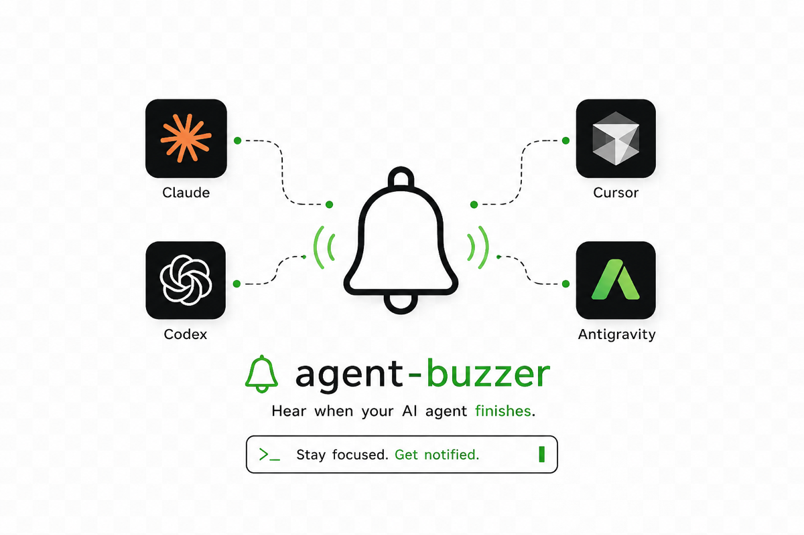

<p align="center">
  <picture>
    <source media="(prefers-color-scheme: dark)" srcset="docs/banner-dark.png">
    
  </picture>
</p>

<h1 align="center">agent-buzzer</h1>

<p align="center">
  Hear when your AI agent finishes, so you can stop watching the terminal.
</p>

<p align="center">
  
</p>

Plays a sound when your agent finishes a long turn, so you can go read something
else instead of babysitting a progress spinner. It stays quiet when you're
already looking at the terminal, and when the turn was too short to be worth
interrupting you for — which is the only reason a tool like this survives past
the first hour.

> **Which agents work today?** Claude Code, fully. Codex, Cursor's agent and
> Antigravity are on the roadmap but **not implemented yet** — the banner shows
> where this is going, not where it is. Everything except the wiring is already
> agent-agnostic, so an adapter is a small, self-contained contribution.
> See [Adding an agent](#adding-an-agent).


<sub>The two blocks are the same command a moment apart: focused on the terminal,
then looked away. A GIF has no sound, so what you're seeing is the decision — and
the half that matters is the `silent` one.</sub>

<!-- Rendered from docs/demo.tape — `vhs docs/demo.tape`. Re-run it whenever the
     CLI output changes rather than letting the GIF drift. -->

## Install

Takes about thirty seconds. No dependencies — it's one shell script.

```sh
git clone https://github.com/<you>/agent-buzzer.git
cd agent-buzzer
./install.sh
```

That copies `buzzer` to `~/.local/bin`, puts the bundled sounds in
`~/.agent-buzzer/sounds`, and writes a default config. Check you can hear it:

```sh
buzzer test done
```

Then wire up the hooks. **buzzer will not do this for you** — a malformed
`~/.claude/settings.json` silently disables every setting in it, so no installer
should be editing yours. Run:

```sh
buzzer hooks
```

and add the snippet it prints via Claude Code's `/hooks` command, or paste it
into `~/.claude/settings.json` yourself:

```json
{
  "hooks": {
    "UserPromptSubmit": [
      { "hooks": [ { "type": "command", "command": "/Users/you/.local/bin/buzzer mark" } ] }
    ],
    "Stop": [
      { "hooks": [ { "type": "command", "command": "/Users/you/.local/bin/buzzer hook done" } ] }
    ],
    "Notification": [
      { "hooks": [ { "type": "command", "command": "/Users/you/.local/bin/buzzer hook waiting" } ] }
    ],
    "SubagentStop": [
      { "hooks": [ { "type": "command", "command": "/Users/you/.local/bin/buzzer hook subagent" } ] }
    ]
  }
}
```

`UserPromptSubmit` is not optional: it records when the turn started, which is
how the short-turn rule works. Without it, every turn counts as "duration
unknown" and plays.

Windows: skip `install.sh` and use `buzzer.ps1` directly. See
[Windows](#windows).

## The silence rules

This is the whole design. A version that beeps after every turn — including
one-line chat replies — becomes unbearable within an hour, so playback is gated.
The rules are checked in order, and the first one that matches wins:

| # | rule | default |
|---|------|---------|
| 1 | `enabled=false` → silent | on |
| 2 | inside quiet hours → silent | **off** (23:00–08:00 when enabled) |
| 3 | turn was shorter than `threshold_seconds` → silent | 30s |
| 4 | your own terminal is the frontmost app → silent | on |
| 5 | otherwise → play | |

Rule 3 only applies to `done` and `error`, which are the only turn-scoped
events. Being asked for permission two seconds in is exactly when you want to
know, so `waiting` and `subagent` skip it.

Rule 4 is the one people find surprising and then can't live without: if the
terminal running Claude is the app you're looking at right now, you don't need a
sound.

**When something can't be determined, it plays.** If focus detection fails, or
the turn duration is unknown, or the config is unreadable, you get the sound.
Missing a notification is a worse failure than one extra beep, and the code says
so in comments so nobody later "fixes" it the other way.

Tuning:

```sh
buzzer threshold 60           # only turns longer than a minute
buzzer quiet-hours 23:00 08:00
buzzer quiet-hours off
buzzer off                    # everything, until you say otherwise
buzzer disable subagent       # just this event
```

## Events

| event | fires when | default sound (macOS) |
|-------|-----------|----------------------|
| `done` | Claude finished its turn | `Glass.aiff` |
| `waiting` | Claude is blocked on a permission prompt or question | `Ping.aiff`, twice |
| `error` | the turn failed or was interrupted | `Basso.aiff` |
| `subagent` | a background/subagent task finished | `Pop.aiff`, quieter |

`error` has no hook in the snippet above because Claude Code has no dedicated
"turn failed" hook today. It's there so you can wire `buzzer hook error` to
whatever surfaces failures in your setup.

## Sounds

```console
$ buzzer list
EVENT      ON   VOLUME  REP  SOUND
done       yes  0.7     1    /System/Library/Sounds/Glass.aiff
waiting    yes  0.7     2    /System/Library/Sounds/Ping.aiff
error      yes  0.7     1    /System/Library/Sounds/Basso.aiff
subagent   yes  0.35    1    /System/Library/Sounds/Pop.aiff
```

Change one by path, by bundled name, or by macOS system sound name:

```sh
buzzer set done bird.wav                                # bundled
buzzer set done Hero                                    # macOS system sound
buzzer set done ~/Music/notifications/kettle.wav        # anything playable
buzzer sounds                                           # what's available here
buzzer volume 0.4                                       # all events
buzzer volume 0.2 subagent                              # just one
```

`bird.wav` is two short chirps, 188ms, generated from scratch by
[`tools/make-sounds.py`](tools/make-sounds.py) with nothing but Python's `math`
and `wave`. It's the recommended one for `done`; system alert sounds carry a
"something went wrong" association that a finished task doesn't deserve.

Got a good sound? [Contribute it](CONTRIBUTING.md) — that's the main thing this
project wants.

## Configuration

`~/.agent-buzzer/config`, plain `key=value`, one per line, `#` starts a
comment. Edit it by hand; the CLI writes the same file.

```ini
enabled=true
threshold_seconds=30
volume=0.7
quiet_hours=false
quiet_start=23:00
quiet_end=08:00

# Which app counts as "your terminal". Empty = detect it from TERM_PROGRAM.
terminal_app=

done_enabled=true
done_sound=/System/Library/Sounds/Glass.aiff
done_volume=
done_repeat=1
```

It's `key=value` rather than JSON so that both the bash and PowerShell versions
can parse it in a few lines with no dependencies — no `jq`, nothing to install.

## When it isn't working

Two commands, in this order. They're the first thing an issue will ask for.

`buzzer status` answers "would it play right now, and if not, what stopped it?"
using the same code the hook uses, so it can't disagree with reality:

```console
$ buzzer status
agent-buzzer 0.1.0
config      /Users/you/.agent-buzzer/config
log         /Users/you/.agent-buzzer/log
platform    macos (Darwin 23.6.0)

enabled            true
threshold_seconds  30
volume             0.7
quiet_hours        off

TERM_PROGRAM       vscode
your terminal      code cursor windsurf vscodium visual studio code
frontmost app      Cursor.app  (that IS your terminal)

would it play right now?
  done      silent  your terminal is frontmost (Cursor.app)
  waiting   silent  your terminal is frontmost (Cursor.app)
  error     silent  your terminal is frontmost (Cursor.app)
  subagent  silent  your terminal is frontmost (Cursor.app)

Note: outside a real hook there is no session_id, so turn duration is
unknown here and the short-turn rule cannot fire. In a real turn it can.
```

`buzzer doctor` checks the machine rather than the decision — audio backend,
focus detection, missing files:

```console
$ buzzer doctor
agent-buzzer 0.1.0 — doctor

[platform]
  os              macos
  uname           Darwin 23.6.0 ... arm64
  bash            3.2.57(1)-release
  TERM_PROGRAM    vscode

[state]
  home            /Users/you/.agent-buzzer (writable)
  config          /Users/you/.agent-buzzer/config
  marks           /Users/you/.agent-buzzer/marks (0 present)

[audio]
  candidates      afplay
  backend (wav)   afplay -> /usr/bin/afplay

[sounds]
  done           ok: /System/Library/Sounds/Glass.aiff
  waiting        ok: /System/Library/Sounds/Ping.aiff
  error          ok: /System/Library/Sounds/Basso.aiff
  subagent       ok: /System/Library/Sounds/Pop.aiff

[focus detection]
  method          osascript / Finder (needs no permissions)
  frontmost now   Cursor.app
  is that you?    yes -> sounds suppressed while it is focused

[hooks]
  buzzer never edits ~/.claude/settings.json. Run "buzzer hooks" for the
  snippet and add it yourself via /hooks.
  settings.json   exists but does not mention buzzer — hooks are probably not wired up yet

RESULT: no problems, 1 warning(s).
```

Every decision is logged with the rule that caused it, capped at ~100 lines:

```console
$ buzzer log | tail -4
2026-07-31T23:57:08+0300 mark: readme-demo
2026-07-31T23:57:08+0300 decision=silent event=done reason="your terminal is frontmost (Cursor.app)"
2026-07-31T23:57:08+0300 mark: readme-demo2
2026-07-31T23:57:08+0300 decision=silent event=done reason="turn too short (0s < 30s)"
```

Hooks never print anything themselves. Anything on a hook's stdout can end up
inside your Claude session, so all of this goes to the log instead, and every
hook exits 0 even when it fails.

## Commands

```
buzzer list                     what plays for which event
buzzer set <event> <path>       change a sound
buzzer test <event>             play it now, ignoring every silence rule
buzzer on | off                 master switch
buzzer enable | disable <event> per-event switch
buzzer threshold <seconds>      short-turn cutoff
buzzer quiet-hours <from> <to>  e.g. 23:00 08:00
buzzer quiet-hours off
buzzer volume <0.0-1.0> [event]
buzzer sounds                   sounds available on this machine
buzzer status                   effective config + would it play right now
buzzer doctor                   audio, focus detection, missing files
buzzer hooks                    the settings.json snippet, for you to add
buzzer log                      recent decisions
buzzer config [key] [value]     read or write config directly
```

`buzzer mark` and `buzzer hook <event>` exist for Claude Code to call, not you.

## How it works

Two hooks and a timestamp file:

- `UserPromptSubmit` runs `buzzer mark`, which reads the hook's JSON from stdin
  and writes the current epoch seconds to
  `~/.agent-buzzer/marks/<session_id>`. Session ids are stripped to
  `[A-Za-z0-9_-]` before being used as filenames. Marks older than 24h get
  cleaned up as it goes.
- `Stop` runs `buzzer hook done`, which diffs against that mark to get the turn
  duration, runs the silence rules, and — if it decides to play — launches the
  player detached and returns immediately. Playback is always fire-and-forget,
  so the hook is back in about 0.3s no matter how long the sound is. Nearly all
  of that is the focus check, which is also capped at 2s: a wedged window server
  must not become a wedged agent session. A decision that bails before the focus
  check takes about 0.03s. Two tests fail if a hook ever blocks — one with a slow
  audio player, one with a focus detector that never answers.

Detecting whether you're looking at the terminal means comparing what the OS
reports as frontmost against `TERM_PROGRAM`, which Claude Code passes through to
hooks:

| `TERM_PROGRAM` | matches frontmost |
|----------------|-------------------|
| `vscode` | Code, Cursor, Windsurf, VSCodium |
| `iTerm.app` | iTerm2, iTerm |
| `Apple_Terminal` | Terminal |
| `ghostty` | Ghostty |
| `WarpTerminal` | Warp |
| `Hyper` | Hyper |
| `WezTerm` | WezTerm |
| `tmux` | nothing — tmux says nothing about the outer terminal, so this counts as unknown, so it plays |

Unset or unrecognised `TERM_PROGRAM` also counts as unknown, and unknown plays.
Override it if your setup isn't detected:

```sh
buzzer config terminal_app "ghostty,kitty"
```

On macOS, "what's frontmost" comes from one specific AppleScript call against
Finder, which takes about 0.1s and needs **no** Accessibility or Automation
permission, so you never see a permission prompt. Two plausible-looking
alternatives are deliberately not used: System Events works but triggers an
Automation permission prompt, and `lsappinfo info -only name` returns empty on
macOS 14 while looking perfectly correct.

## Adding an agent

Claude Code is the only agent wired up today. Adding another is a genuinely
small change, because almost nothing here knows or cares which agent it is
serving. An adapter has to answer exactly three questions:

1. **How does the agent tell us something happened?** Claude Code has hooks —
   you register a command in `settings.json` and it runs with a JSON payload on
   stdin. Another agent might offer a shell hook, a log file to tail, an exit
   code, or a notification socket.
2. **How do we identify a turn?** Claude Code's payload carries a `session_id`,
   which is what lets `buzzer mark` and `buzzer hook` pair up and measure the
   duration. Without one, duration is unknown — which plays, so an adapter that
   cannot answer this still works, it just loses the short-turn rule.
3. **How do we know which terminal it's running in?** Claude Code passes
   `TERM_PROGRAM` through. If yours doesn't, users can set `terminal_app` by
   hand and everything else still applies.

Everything downstream of those three answers — the silence rules, focus
detection, playback, config, the CLI — is already shared and needs no changes.
Map your agent's events onto the four this tool knows about (`done`, `waiting`,
`error`, `subagent`), or a subset of them, and you're done.

If you build one, the tests are the specification: `tests/run.sh` encodes every
silence rule as an executable assertion. An adapter that makes those pass
behaves correctly by construction.

## Platforms

macOS is the reference implementation and the one that's had real use. Linux and
Windows work but are best-effort.

**macOS** — `afplay` for audio (`.aiff`, `.wav`, `.mp3`, `.m4a`), AppleScript
for focus. Tested on macOS 14 (Apple Silicon), including the system bash 3.2.

**Linux** — first audio backend found wins: `pw-play`, `paplay`,
`ffplay`, `mpv`, `aplay` (skipped for anything but `.wav`, which is all it
understands). Focus on X11 via `xdotool`, falling back to `xprop`.

### Windows

No installer. Use the script directly:

```powershell
git clone https://github.com/<you>/agent-buzzer.git
cd agent-buzzer
.\buzzer.ps1 list
.\buzzer.ps1 test done
.\buzzer.ps1 hooks     # prints the snippet, using powershell -File ...
```

Audio goes through `System.Windows.Media.MediaPlayer` (WAV and MP3), falling
back to `System.Media.SoundPlayer` (WAV only). Focus comes from
`GetForegroundWindow` plus `GetWindowThreadProcessId`. It reads the same
`key=value` config file as the bash version.

## Limitations

Worth knowing before you file an issue:

- **Wayland focus detection barely works.** There is no portable way to ask
  "which window is focused" across compositors. sway is supported via `swaymsg`;
  everything else reports unknown, which means you'll get sounds even while
  looking at the terminal. X11 is fine.
- **Linux and Windows are less battle-tested than macOS.** The silence rules are
  covered by tests on all three, but the platform-specific parts — audio
  backends, focus detection — have had far more real use on macOS. Bug reports
  with `buzzer doctor` output are genuinely welcome.
- **tmux, screen and SSH hide your terminal.** `TERM_PROGRAM` doesn't survive
  them, so buzzer can't tell that the terminal is in front of you and will play
  anyway. Set `terminal_app=` to fix it for your setup.
- **Only Claude Code is wired up.** The name is aspirational and the banner shows
  the intent, not the state. See [Adding an agent](#adding-an-agent) — the
  adapter surface is deliberately three questions wide.
- **`error` depends on your Claude Code version.** It's wired to the
  `StopFailure` hook. If your build doesn't recognise that event name it will say
  so when you add it; drop that one block and the other four still work.
- **No dedicated "still working" heartbeat.** It notifies on transitions, not
  progress.

## Contributing

Sounds first, code second — see [CONTRIBUTING.md](CONTRIBUTING.md).

```sh
./tests/run.sh
```

## License

MIT. See [LICENSE](LICENSE).
